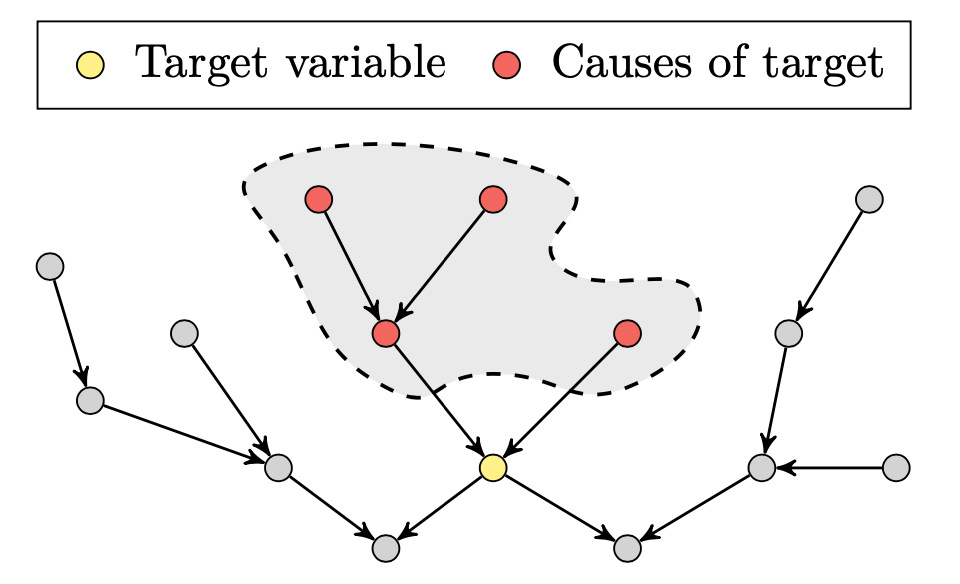

# Targeted-Cause-Discovery
Official Python implementation for "Targeted Cause Discovery with Data-Driven Learning". This repository provides inference codes for TCD-DL model.




## Setup
```
conda create --name tcd python=3.10
conda activate tcd
pip install -r requirements.txt
```
- To use CUDA, download PyTorch as `pip install torch==1.13.1+cu116 --extra-index-url https://download.pytorch.org/whl/cu116`.


## Human cell analysis
We provide jupyter notebook file for human cell analysis conducted in our paper
- Download all files in [Download link](https://drive.google.com/drive/folders/1_oW92QeXaJyns0i4DMRn67p58XZmwtiq?usp=share_link) and open `leukemia_analysis.ipynb`.

The files above contain the cause scores obtained by our model. You can obtain the scores using your own computing resources by following the steps below.

### 1. Download data (Perturb-seq)
We release preprocessed Perturb-seq dataset in [Google Drive](https://drive.google.com/drive/folders/10EFQHRdPUxQa_Ux3v9PZvfVnRO74U6dL?usp=share_link). Download the k562 folder from the link, and set `DATAPATH` in `args.py` to point to the directory containing the k562 folder.

### 2. Run our model
Obtain the predicted cause scores on the Perturb-seq dataset by running
```
python -B run.py --data_file human
```
- You can select target variable by `--target_idx [int]`. The gene list is provided in the jupyter notebook above.


## Inference on custom data
1. Write data loading codes at `data/load.py` - `load_test_data` function. You need to load observation data matrix (n_obs x n_var), intervention matrix (n_obs x n_var, boolean), and a causal adjacency matrix (n_var x n_var).
2. Run the code 
    ```
    python -B run.py --data_file custom
    ```

The default model is well-suited for UMI count data. You can also test other types of trained models, including those trained on imputed data or continuous data: 
1. Download the model checkpoints from the [Google Drive](https://drive.google.com/drive/folders/1ceCsC3w8HR-2Bl3dNWh7RsEm8L9dGixH?usp=share_link) and locate the folders at `./ckpt`. 
2. Run the `run.py`. Set `--model_type continuous`